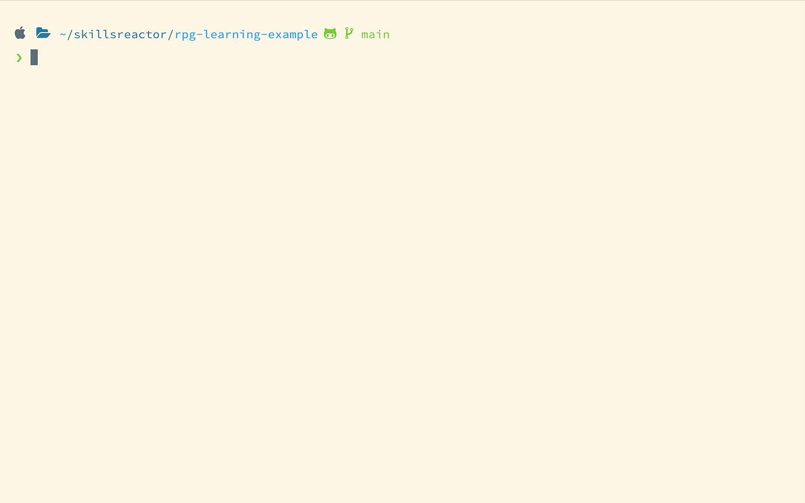

# RPG Learning Example


## Description

A beginner friendly command line RPG game that serves as an introduction to Constructor functions, prototypes, CommonJS modules, native Node.js modules, promises, error-first style callbacks, object destructuring, arrow function expressions, ternary operators, and third-party npm modules.

Issue creation and pull requests are welcome and encouraged. Be sure to check the [contributing guidelines](#contributing) before contributing!

Videos and articles regarding this project can be found on the [SkillsReactor](https://skillsreactor.com) website.

The latest release can be downloaded [here!](https://github.com/skillsreactor/rpg-learning-example/releases/latest)

## Table of Contents

* [Installation](#installation)

* [Usage](#usage)

* [Media](#media)

* [License](#license)

* [Contributing](#contributing)

* [Questions](#questions)

## Installation

To install dependencies:

```
npm install
```

## Usage

To execute a single round of the game:

```
node index.js
```

## Media

### Gameplay



## License

This software is licensed under the MIT license.

## Contributing

[Contribution guidelines for this software](CONTRIBUTING.md)

## Questions

If you have any questions regarding this software, open an issue or email [aaron@skillsreactor.com](mailto:aaron@skillsreactor.com)
